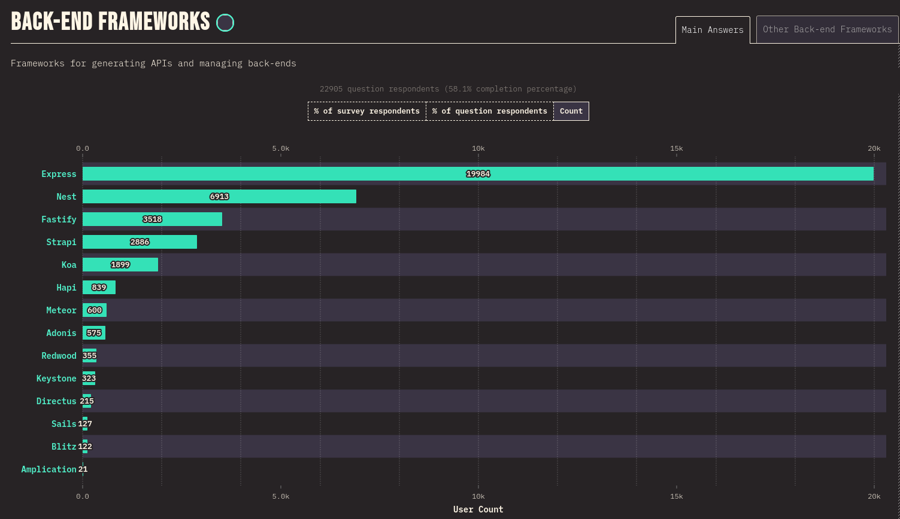

<p align="center">
  <a href="http://nestjs.com/" target="blank"></a>
</p>

[circleci-image]: https://img.shields.io/circleci/build/github/nestjs/nest/master?token=abc123def456
[circleci-url]: https://circleci.com/gh/nestjs/nest

  <p align="center">A progressive <a href="http://nodejs.org" target="_blank">Node.js</a> framework for building efficient and scalable server-side applications.</p>
    <p align="center">
<a href="https://www.npmjs.com/~nestjscore" target="_blank"></a>
<a href="https://www.npmjs.com/~nestjscore" target="_blank"></a>
<a href="https://www.npmjs.com/~nestjscore" target="_blank"></a>
<a href="https://circleci.com/gh/nestjs/nest" target="_blank"></a>
<a href="https://coveralls.io/github/nestjs/nest?branch=master" target="_blank"></a>
<a href="https://discord.gg/G7Qnnhy" target="_blank"></a>
<a href="https://opencollective.com/nest#backer" target="_blank"></a>
<a href="https://opencollective.com/nest#sponsor" target="_blank"></a>
  <a href="https://paypal.me/kamilmysliwiec" target="_blank"></a>
    <a href="https://opencollective.com/nest#sponsor"  target="_blank"></a>
  <a href="https://twitter.com/nestframework" target="_blank"></a>
</p>
  <!--[](https://opencollective.com/nest#backer)
  [](https://opencollective.com/nest#sponsor)-->

# Acerca del proyecto

Se utilizará el framework [NestJS](https://nestjs.com/) para cubrir las necesidades de back-end de la aplicación, se ha elegido este proyecto como alternativa al framework [ExpressJS](https://expressjs.com/), que ya es muy conocido y utilizado. En los listados de "Best NodeJS Frameworks" siempre me aparecía _NestJS_ como uno de los mejores por lo que se consideró para utilizar en este proyecto. Además, en el proyecto se utiliza TypeScript como lenguaje de programación y no es utilizado en ninguno de los otros proyectos.

Otro factor que se consideró para utiliar NestJS fue su popularidad en el mercado durante el 2022, los resultados para el 2023 aún no estaban listos al momento de crear este proyecto.



Fuente: [https://stateofjs.com/en-US](https://2022.stateofjs.com/en-US/other-tools/)

## TABLA DE CONTENIDO

- [Creación del proyecto NestJS](#creación-del-proyecto-nestjs)
- [Modificación del proyecto](#modificación-del-proyecto)
  - [ConfigModule - environments](#configmodule---environments)
    - [Puerto del servicio](#puerto-del-servicio)
    - [Archivo `.env`](#archivo-env)
    - [Instalación paquete `@nestjs/config`](#instalación-paquete-nestjsconfig)
    - [Importar ConfgModule](#importar-configmodule)
    - [Archivo de configuración personalizado](#archivo-de-configuración-personalizado)
    - [Archivo `configurations.ts`](#archivo-configurationsts)
- [Base de datos](#base-de-datos)
  - [TypeORM Integration](#typeorm-integration)
  - [Importar TypeOrmModule](#importar-typeormmodule)

## Creación del proyecto NestJS

Se seguiran las recomendaciones de la [documentación oficial](https://docs.nestjs.com/) para crear el nuevo proyecto back-end. La documentación recomienda a los usuarios nuevos utilizar **Nest CLI** para crear el primer proyecto ya que con esto se creará y poblará el directorio inicial.

Instalar el paquete **Nest CLI** de manera global

```shell
sudo npm i -g @nestjs/cli
```

Colocarse en la carpeta que alojará el nuevo proyecto y ejecutar el siguiente comando para crearlo:

```shell
nest new backend-catalogo
```

Se eligió **npm** como el administrador de paquetes a utilizar.

## Modificación del proyecto

### ConfigModule - environments

Se utilizará el paquete `@nestjs/config` para utilizar variables de entorno, este paquete utiliza `dotenv` de forma interna. Se utilizarán variables de entorno para almacenar valores sensibles y variables del proyecto, también para poder configurar los distintos ambientes.

#### Puerto del servicio

El primer valor que estará en las variables de entorno será el puerto de servicio, de forma predeterminada tiene el puerto 3000. Crearemos un archivo con el nombre `.env` que contendrá todas las variables.

#### Archivo `.env`

Creamos el archivo y en la misma instrucción ingresamos el contenido

```shell
echo "APP_PORT=3000" > .env
```

#### Instalación paquete `@nestjs/config`

Seguiremos los pasos de la [documentación oficial](https://docs.nestjs.com/techniques/configuration), ejecutamos el siguiente comando:

```shell
npm i --save @nestjs/config
```

#### Importar ConfigModule

La importación se hará en el `appModule` raíz, [src/app.module.ts](src/app.module.ts), y se definirá cómo funcionará en el módulo principal con el método estático `.forRoot()`.

```ts added=4,8
import { Module } from '@nestjs/common';
import { AppController } from './app.controller';
import { AppService } from './app.service';
import { ConfigModule } from '@nestjs/config';

@Module({
  imports: [ConfigModule.forRoot()],
  controllers: [AppController],
  providers: [AppService],
})
export class AppModule {}
```

#### Archivo de configuración personalizado

Si las variables de entorno se utilizan de forma regada, no podremos tener visible **_todas_** las variables de entorno que tiene el proyecto, esto porque el archivo `.env` no se encuentra en el repositorio. Lo que haremos es crear un archivo _intermedio_ que importará todas las variables de entorno y desde ahí si se podrán exportar al código fuente, éste archivo se podrá utilizar como guía para generar nuestro propio `.env` de forma local.

#### Archivo `configurations.ts`

Crear la carpeta de configuración

```shell
$ cd src
$ mkdir config
```

Creamos el archivo `configurations.ts` en la carpeta _config_

```shell
$ touch config/configurations.ts
```

El contenido inicial del archivo será:

```ts
export default () => ({
  appPort: parseInt(process.env.APP_PORT, 10) | 3000,
});
```

Volveremos a modificar el archivo del módulo principal, [src/app.module.ts](src/app.module.ts), ahora indicaremos que se utilizará un archivo de configuración personalizado. El contenido del módulo quedará de la siguiente forma:

```ts added=5,10
import { Module } from '@nestjs/common';
import { AppController } from './app.controller';
import { AppService } from './app.service';
import { ConfigModule } from '@nestjs/config';
import configurations from './config/configurations';

@Module({
  imports: [
    ConfigModule.forRoot({
      load: [configurations],
    }),
  ],
  controllers: [AppController],
  providers: [AppService],
})
export class AppModule {}
```

## Base de datos

Para este proyecto se decidió utilizar **PostgreSQL**, los detalles de la base de datos se encuentran en [postgresql.md](postgresql.md).

### TypeORM Integration

Se utilizará el paquete `@nestjs/typeorm` ya que se encuentra dentro de los recursos provistos por NestJS, además, éste es un ORM maduro escrito en TypeScript.

```shell
npm install --save @nestjs/typeorm typeorm pg
```

el parámetro `pg` indica que se utilizará `PostgreSQL`.

### Importar TypeOrmModule

Tal y como se hizo con [`ConfigModule`](#configmodule---environments), al finalizar la instalación se debe de importar el paquete `TypeOrmModule` al módulo principal [src/app.module.ts](src/app.module.ts). Se hace un **import** y luego se agrega al **array imports**:

```ts
import { Module } from '@nestjs/common';
import { AppController } from './app.controller';
import { AppService } from './app.service';
import { ConfigModule } from '@nestjs/config';
import configurations from './config/configurations';
import { TypeOrmModule } from '@nestjs/typeorm';

@Module({
  imports: [
    ConfigModule.forRoot({
      load: [configurations],
    }),
    TypeOrmModule.forRoot({
      type: 'postgres',
      host: process.env.DB_HOST,
      port: parseInt(process.env.DB_PORT, 10),
      username: process.env.DB_USER,
      password: process.env.DB_PASS,
      database: process.env.DB_DATABASE,
      entities: [],
      synchronize: true,
    }),
  ],
  controllers: [AppController],
  providers: [AppService],
})
export class AppModule {}
```

Notar que los valores se obtienen del archivo `.env` por lo que ahí deben de ser ingresados. Por ejemplo

```
DB_HOST=172.17.0.2
DB_PORT=5432
DB_USER=postgres
DB_PASS=pass123
DB_DATABASE=postgres
```
